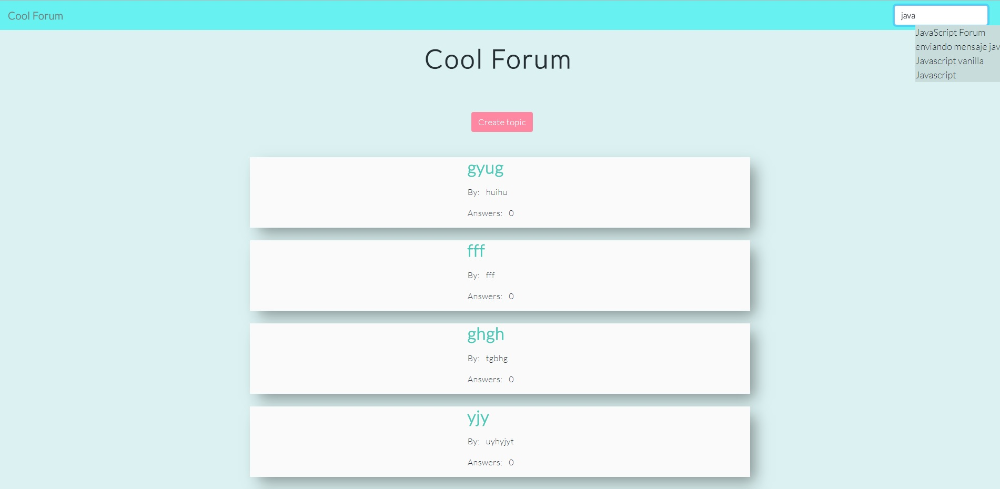
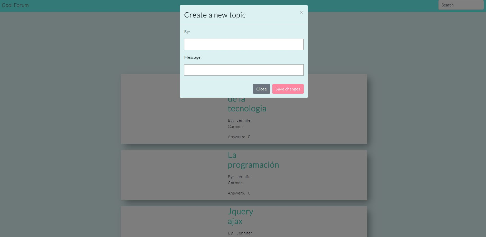
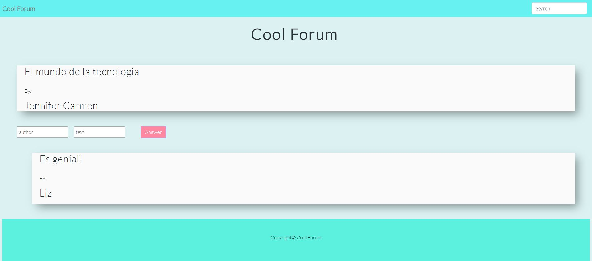

# Foro de opinión

## es una aplicación que permite al usuario poder acceder a todos los temas creados en el foro, ver cuántas respuestas tienen y publicar respuestas a cada tema, además de crear tema nuevos. Asimismo, tiene la opción de hacer una búsqueda de los temas disponibles en la parte superior derecha.

## herramientas: html5, Bootstrap4, css3, js

## L página deberá de verse como se muestra a continuacón
### Desktop

